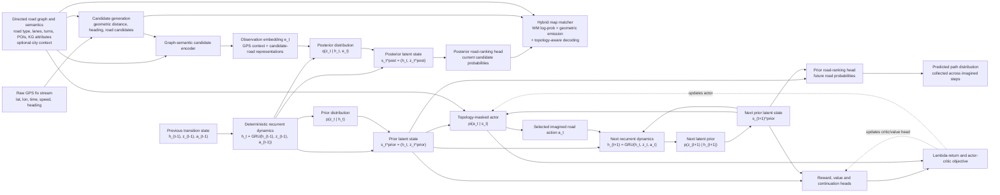

# Improving World Models for AI-Driven Map Matching and Path Prediction

## Executive summary

Your world model is stalled for a mathematical reason first, and an architectural reason second.

The best near world model is a **graph-conditioned, decoder-light or decoder-free, discrete RSSM** in the **Dreamer / MuDreamer / TD-MPC2 lineage**, trained for imagined rollouts and path prediction, but decoded for matching through a **hybrid emission** that combines geometry with learned road probabilities. That recommendation is consistent with your own methodology synthesis, with PlaNet’s stochastic-deterministic latent dynamics, with DreamerV2/V3’s discrete world-model line, with MuDreamer’s evidence for removing reconstruction, and with TD-MPC2’s demonstration that decoder-free world models scale well when the objective is decision quality rather than observation fidelity.

The most important practical conclusion is blunt: if you want the **scalar loss** to drop below the current floor, you must change the **KL flooring scheme**. If you want the **product metrics** to improve, you should stop optimizing for total loss as the headline KPI and instead optimize **road excess cross-entropy, hybrid match@1, prediction hit@K, jump rate, OOD delta, and latency**.

## Why the current world model stalls

DreamerV3’s published world-model objective uses asymmetric KL balancing with stop-gradients and then clips the dynamics and representation KL losses below **1 nat**. If your implementation instead clips the **aggregate** KL at **9.6**, then once `kl_dyn_raw` and `kl_rep_raw` fall below that value, the derivative of the clipped term with respect to the raw KL becomes zero almost everywhere. In plain engineering terms, you have turned the KL into a near-constant offset while still letting it dominate the scalar objective. That is exactly how you can end up with a flat `total`, a seemingly “healthy” KL number, and a world model that still behaves close to guessing. 

The another issue is **dataset / target mismatch**, and it matters more than many WM projects initially expect. Your project summary notes that the road head is trained on **geometry-derived soft pseudo-labels**, and that the **cross-entropy floor equals the target entropy and has not been measured**. If the pseudo-targets are broad or ambiguous, then a road CE around 1.2–1.5 may be much closer to the irreducible floor than it appears. This is why “road CE” should be decomposed into **target entropy** and **excess CE**. Without that instrumentation, you cannot tell whether the model is failing or whether the teacher is simply uncertain.

The next issue is objective mismatch between **matching** and **reward optimization**. Your own experiments already showed that the Stage-3 actor underperformed the supervised road head for map matching. That is a very important diagnostic: it means the reward you used for RL is not aligned with the exact map-matching metric you care about. RL is still valuable for path prediction and planning, but the actor should not be your primary matching decoder until the reward is proven strongly aligned with road-level correctness.

Finally, some summerized issues which we already tackled or faced and known are: 

- Decoder Bypass (Posterior Collapse): As seen in VAE literature, an overly expressive decoder allows the deterministic state (h) to "freeload" via teacher-forced road embeddings to hit GPS/road targets. This bypasses the stochastic latent (z), losing the model's ability to capture uncertainty and multimodality (crucial in PlaNet-style architectures).

- Multi-Task Conflict: Overloading a single latent state with too many tasks (spatial reconstruction, road classification, reward modeling, and actor-critic) creates internal conflicts, such as the GPS head vs. road scorer. Gradient balancers like PCGrad or GradNorm only offer incremental help. The root cause is the decoder giving the deterministic path an escape route, making a decoder-free or decoder-light redesign the superior fix.

- Generalization Mismatch: Learned emissions are currently city-specific. Models trained on Porto fail zero-shot on T-Drive and require retraining for Silesia. You cannot claim cross-city robustness without adding multi-city pretraining, adaptation layers, or a geometry-based fallback policy.

## Which world-model architecture fits this task best

The architecture family that best matches your constraints is a **graph-conditioned, discrete latent, decoder-light or decoder-free RSSM**. PlaNet established the value of combining deterministic and stochastic latent dynamics and introduced multi-step latent overshooting for better long-horizon predictions. Dreamer and DreamerV2/V3 showed that imagined rollouts over those latent states can train strong behaviors, and that **discrete** latent representations are especially effective in high-uncertainty environments. MuDreamer then showed that removing reconstruction can improve robustness and avoid modeling irrelevant nuisance details, while TD-MPC2 demonstrated that decoder-free world models can scale strongly when the target is control quality rather than reconstruction fidelity.

For **road-network data specifically**, the missing ingredient is graph structure. VectorNet showed that vectorized map and trajectory representations can be encoded efficiently with hierarchical graph modeling. START and JCLRNT showed that road-network and trajectory semantics can be learned self-supervised with graph attention, time-aware sequence encoding, and contrastive objectives. RouteKG showed that knowledge-graph structure and direction-aware relations can improve route prediction on road networks. Put together, those results strongly suggest that the right architecture in your domain is not a plain Dreamer clone, but a Dreamer-style latent dynamics model **conditioned on graph-structured road semantics**. That is an inference, but it is a well-supported one. 

### Recommended architecture

The best recommendation is a **Graph-Conditioned Decoder-Light Discrete RSSM** with Dreamer-style imagined RL on top, but with **matching decoded by a hybrid emission** rather than by the actor alone.

## Mathematical objectives that should reduce loss

The mathematically best way to reduce your current scalar loss is simple: **stop using a giant hard free-bits floor on the aggregate KL**. The best way to improve product metrics is a little different: keep enough KL pressure to maintain an informative latent, but move the optimization budget toward **road prediction and topology-aware forecasting**.

### Immediate changes to the current RSSM objective

DreamerV3 optimizes the world-model objective

$$
\mathcal L_{\mathrm{WM}}(\phi)
=
\mathbb E_{q_\phi}
\left[
\sum_{t=1}^{T}
\left(
\beta_{\mathrm{pred}}\mathcal L_{\mathrm{pred},t}
+
\beta_{\mathrm{dyn}}\mathcal L_{\mathrm{dyn},t}
+
\beta_{\mathrm{rep}}\mathcal L_{\mathrm{rep},t}
\right)
\right],
$$

with

$$
\beta_{\mathrm{pred}}=1,\qquad
\beta_{\mathrm{dyn}}=1,\qquad
\beta_{\mathrm{rep}}=0.1.
$$

Its balanced KL losses are

$$
\mathcal L_{\mathrm{dyn},t}
=
\max\left(
C_{\mathrm{free}},
\operatorname{KL}
\left[
\operatorname{sg}(q_t)\Vert p_t
\right]
\right),
$$

$$
\mathcal L_{\mathrm{rep},t}
=
\max\left(
C_{\mathrm{free}},
\operatorname{KL}
\left[
q_t\Vert\operatorname{sg}(p_t)
\right]
\right),
$$

where DreamerV3 uses $C_{\mathrm{free}}=1$ nat. This free-bits threshold creates a no-penalty region; it is not a target that the KL is required to equal.

Before changing the threshold, the implementation must establish whether free bits are applied to the aggregate KL or independently to each categorical latent group. An aggregate value of 9.6 nats is not equivalent to 9.6 nats per group. For $G$ groups,

$$
C_{\mathrm{aggregate}}
=
G \cdot C_{\mathrm{group}}.
$$

Therefore, if the current value of 9.6 is obtained from 16 groups with 0.6 nat per group, its correct per-group comparison is 0.6 nat rather than 9.6 nats.

I do not recommend replacing the Dreamer KL losses with

$$
\lambda\operatorname{softplus}(K-C_t),
$$

because this function is monotonically increasing in $K$:

$$
\frac{\partial}{\partial K}
\left[
\lambda\operatorname{softplus}(K-C_t)
\right]
=
\lambda\sigma(K-C_t)>0.
$$

Minimizing it therefore always pushes the KL downward rather than toward $C_t$, potentially increasing the risk of posterior collapse.

If a smooth approximation to Dreamer-style free bits is desired for an ablation, it can instead be written as

$$
\operatorname{sfree}_{\tau}(K;C)
=
C+
\tau\operatorname{softplus}
\left(
\frac{K-C}{\tau}
\right),
$$

where $\tau>0$ controls the smoothness. As $\tau\rightarrow 0$,

$$
\operatorname{sfree}_{\tau}(K;C)
\rightarrow
\max(C,K).
$$

This formulation should be described as a smooth free-bits clamp, not as information-capacity targeting. It also should not be introduced until the aggregation convention and active-KL fraction have been measured.

The following quantities should be logged before changing the KL objective:

$$
K_{t,g}
=
\operatorname{KL}
\left[
q_{t,g}\Vert p_{t,g}
\right],
$$

$$
r_{\mathrm{active}}
=
\frac{1}{BTG}
\sum_{b,t,g}
\mathbf 1
\left[
K_{b,t,g}>C_{\mathrm{free},g}
\right],
$$

together with posterior entropy, prior entropy, marginal categorical usage, and the number of active latent groups. These measurements distinguish a healthy predictable latent from a collapsed latent more reliably than the aggregate KL alone.

The road-ranking objective should continue to use soft-target cross-entropy for optimization:

$$
\mathcal L_{\mathrm{road}}
=
\operatorname{CE}(\tilde y_t,\hat y_t).
$$

For interpretation, report the excess road loss:

$$
\mathcal L_{\mathrm{road-excess}}
=
\operatorname{CE}(\tilde y_t,\hat y_t)
-
H(\tilde y_t)
=
\operatorname{KL}
\left(
\tilde y_t\Vert\hat y_t
\right).
$$

This reveals how far the model remains above the uncertainty floor of the geometry-derived teacher. However, because $H(\tilde y_t)$ is independent of the model parameters, excess road loss and raw cross-entropy produce identical gradients. It is therefore primarily an instrumentation metric rather than a new optimization objective.

Aggressive posterior or encoder updates should be activated only when there is evidence of inference lag. Suitable triggers include a sustained decrease in estimated conditional mutual information, posterior marginal entropy collapse, a falling fraction of active groups, weak z-ablation performance, or a large imbalance between encoder and dynamics gradient norms. Prior/posterior disagreement alone should not be used as a collapse trigger because disagreement can be appropriate when a GPS observation resolves a genuinely ambiguous road choice.

### Recommended objective for the graph-conditioned decoder-light world model

For the redesigned world model, use the following training objective:

$$
\mathcal{L}_{\mathrm{WM}}
=

\sum_{t=1}^{T}
\Bigg[
\lambda_{\mathrm{road}}
,
\mathrm{CE}
\left(
\widetilde{y}*t,
\pi_t^{\mathrm{post}}
\right)
+
\lambda*{\mathrm{prior}}
,
\mathrm{CE}
\left(
\widetilde{y}*t,
\pi_t^{\mathrm{prior}}
\right)
+
\lambda_r
\mathcal{L}*{r,t}
+
\lambda_c
\mathcal{L}*{c,t}
+
\mathcal{L}*{\mathrm{dyn},t}^{\mathrm{soft}}
+
\mathcal{L}*{\mathrm{rep},t}^{\mathrm{soft}}
+
\lambda*{\mathrm{nce}}
\sum_{k=1}^{H}
\mathcal{L}*{\mathrm{NCE},t}^{(k)}
+
\lambda*{\mathrm{topo}}
\mathcal{L}_{\mathrm{topo},t}
\Bigg].
$$

Here, (\widetilde{y}_t) is the geometry-derived soft road target, (\pi_t^{\mathrm{post}}) is the posterior road distribution, and (\pi_t^{\mathrm{prior}}) is the prior road distribution.

The dynamics and representation KL terms are:

$$
K_{\mathrm{dyn},t}
=

\mathrm{KL}
\left(
\mathrm{sg}(q_t)
;\Vert;
p_t
\right),
$$

$$
K_{\mathrm{rep},t}
=

\mathrm{KL}
\left(
q_t
;\Vert;
\mathrm{sg}(p_t)
\right).
$$

A smooth approximation to the standard free-bits clamp can be defined as:

$$
\mathrm{SoftFree}_{\tau}(K,C)
=

C
+
\tau
\log
\left(
1
+
\exp
\left(
\frac{K-C}{\tau}
\right)
\right),
$$

where (C) is the free-bits threshold and (\tau>0) determines the smoothness.

The corresponding KL losses are:

$$
\mathcal{L}_{\mathrm{dyn},t}^{\mathrm{soft}}
=

\mathrm{SoftFree}*{\tau}
\left(
K*{\mathrm{dyn},t},
C_{\mathrm{free}}
\right),
$$

$$
\mathcal{L}_{\mathrm{rep},t}^{\mathrm{soft}}
=

\beta_{\mathrm{rep}}
,
\mathrm{SoftFree}*{\tau}
\left(
K*{\mathrm{rep},t},
C_{\mathrm{free}}
\right).
$$

As (\tau) approaches zero, this function approaches the standard hard free-bits clamp:

$$
\lim_{\tau \to 0}
\mathrm{SoftFree}_{\tau}(K,C)
=

\max(C,K).
$$

This formulation smooths the free-bits boundary. It should not be interpreted as forcing the KL divergence toward (C).

### Multi-step contrastive prediction

For prediction horizon (k), let (\widehat{z}*{t+k}) be the latent predicted by recursively applying the prior dynamics, and let (\overline{z}*{t+k}) be a stop-gradient target produced by the posterior encoder.

The contrastive predictive loss is:

$$
\mathcal{L}_{\mathrm{NCE},t}^{(k)}
=

*

\log
\left[
\frac{
\exp
\left(
\mathrm{sim}
\left(
\widehat{z}*{t+k},
\overline{z}*{t+k}
\right)
/
\tau_{\mathrm{nce}}
\right)
}{
\sum_{b=1}^{B}
\exp
\left(
\mathrm{sim}
\left(
\widehat{z}*{t+k},
\overline{z}*{b,t+k}
\right)
/
\tau_{\mathrm{nce}}
\right)
}
\right].
$$

Here, (B) is the batch size, (b) indexes the positive and negative target embeddings in the batch, and (\tau_{\mathrm{nce}}>0) is the contrastive temperature.

This objective encourages the prior dynamics to preserve information that is useful for predicting future road-network states rather than reconstructing nuisance spatial details.

### Topological consistency loss

Let

$$
\mathcal{V}(y_t,G)
$$

denote the set of valid successor candidates from the current road segment (y_t) in the directed road graph (G).

A differentiable topological consistency loss is:

$$
\mathcal{L}_{\mathrm{topo},t}
=

*

\log
\left[
\epsilon
+
\sum_{j \in \mathcal{V}(y_t,G)}
\pi_{t+1,j}^{\mathrm{prior}}
\right],
$$

where (\epsilon>0) is a small numerical-stability constant.

This objective penalizes the model when it assigns probability mass to disconnected or directionally invalid road segments. It therefore directly targets the non-connected-road jumps observed during online matching.

If exactly one successor pseudo-target (y_{t+1}) is available, the topology loss can instead use:

$$
\mathcal{L}_{\mathrm{topo},t}
=

*

\log
\left(
\pi_{t+1,y_{t+1}}^{\mathrm{prior}}
+
\epsilon
\right).
$$

### Hybrid map-matching decoder

The actor should not be used as the primary map-matching decoder. Instead, define a combined candidate score:

$$
S_t(j)
=

\alpha
\log
p_{\mathrm{geom}}
\left(
j \mid g_t
\right)
+
(1-\alpha)
\log
p_{\mathrm{wm}}
\left(
j \mid h_t,z_t,G
\right)
+
\eta
\log
T
\left(
j \mid y_{t-1},G
\right),
$$

where:

* (g_t) is the current GPS observation;
* (G) is the directed local road graph;
* (y_{t-1}) is the previously selected road segment;
* (T(j \mid y_{t-1},G)) is the topology-aware transition score;
* (\alpha) controls the balance between geometry and the world model;
* (\eta) controls the strength of the topology term.

The normalized local road probability is:

$$
p
\left(
m_t=j
\right)
=

\frac{
\exp
\left(
S_t(j)
\right)
}{
\sum_{\ell \in \mathcal{C}_t}
\exp
\left(
S_t(\ell)
\right)
},
$$

where (\mathcal{C}_t) is the candidate-road set for observation (t).

For offline sequence decoding, (S_t(j)) should be used inside a Viterbi-style dynamic program rather than normalizing every step independently.

### Secondary objective upgrades

If prior rollouts remain inaccurate after the main objective is stable, multi-step latent overshooting can be added.

Let (p^{(k)}_{t+k}) denote the latent prior obtained after recursively applying the dynamics model for (k) steps from time (t). The overshooting loss is:

$$
\mathcal{L}_{\mathrm{over}}
=

\sum_{t=1}^{T}
\sum_{k=1}^{H}
\omega_k
,
\mathrm{KL}
\left(
\mathrm{sg}
\left(
q_{t+k}
\right)
;\Vert;
p^{(k)}_{t+k}
\right),
$$

where (\omega_k) can decrease with the prediction horizon.

This loss directly pressures the prior dynamics to remain accurate during multi-step path prediction.

An importance-weighted variational objective can also be considered as a later experiment:

$$
\mathcal{L}_{\mathrm{IWAE}}
=

*

\mathbb{E}
\left[
\log
\left(
\frac{1}{S}
\sum_{s=1}^{S}
w_s
\right)
\right],
$$

with importance weights:

$$
w_s
=

\frac{
p_{\theta}
\left(
x,z^{(s)}
\right)
}{
q_{\phi}
\left(
z^{(s)} \mid x
\right)
}.
$$

Here, (S) is the number of importance samples. This symbol is deliberately different from (H), which denotes the prediction horizon.

If the stochastic latent remains underused, vector-quantized discrete latents can be evaluated as a later architecture change. This should not be combined with the first objective ablation because it changes both the latent parameterization and the training loss.

For long-horizon route intention, a hierarchical latent state can be defined as:

$$
z_t
=

\left(
z_t^{\mathrm{local}},
z_{\lfloor t/M \rfloor}^{\mathrm{route}}
\right),
$$

where (z_t^{\mathrm{local}}) is updated at every time step and (z_{\lfloor t/M \rfloor}^{\mathrm{route}}) is updated once every (M) steps.

The hierarchical latent should be treated as a later-stage extension after the decoder-light prior and the multi-step prediction objective have been validated.

###### Training recipe I would use

For the **near-term winning recipe**, I would keep the streaming-friendly recurrent core and avoid a full autoregressive Transformer in the online path. Concretely:

- **Encoder**: graph semantic encoder over k-candidate local road subgraphs, with road attributes, direction, turn legality, lane count, road class, and a learned city token. START / JCLRNT-style self-supervised pretraining on road/trajectory pairs is a strong initialization if you can afford it. 

- **Dynamics core**: GRU-based or S5-style RSSM for the online product path; keep Transformer world models for offline experimentation only unless latency budget is loose. PlaNet’s RSSM and Dreamer’s line remain the right default for streaming control. 

- **Latent**: move from **16×16** to **32×32 categorical** as your first capacity probe. Your own project summary explicitly identifies the current latent as a 4× downscale from DreamerV3’s default regime and already sequences this probe after continued data scaling. 

- **Batch and sequence length**: keep roughly your proven starting point of **batch 256** and curriculum-aware sequence lengths that actually receive nontrivial learning rate budget; your own run history showed that sequence-length scheduling can matter materially. 

- **Optimizer**: Adam or AdamW is the conservative choice.
  
- **Learning rate**: keep **3e-4 to 4e-4** for the world model as the starting band, because your successful P1 runs used **4e-4** and the flat-LR probe showed the late plateau was genuine convergence rather than a dead-LR artifact. 

- **Replay**: rebalance toward ambiguous intersections, flyovers, closely parallel roads, sparse-gap sequences, and road-class transitions; those are the examples where a world model can genuinely beat pure geometry. This part is an engineering recommendation, but it follows directly from your observed failure modes.  

- **Actor / critic**: keep them, but gate their success on **prediction** tasks, not on matching. Your actor already underperformed the road head on matching; do not let that objective dominate training. fileciteturn0file3L26-L26 fileciteturn0file5L121-L123  

That strategy uses your own empirical scaling order and avoids spending months on a huge model while the target entropy and city shift are still the real bottlenecks. 

### What you should track from now on

You need a tighter metric dashboard than `total`.

Track at least these quantities every evaluation cycle:

1. **raw KL and post-clamp KL per latent group**, not just summed scalars  
2. **posterior entropy**, **prior entropy**, and a simple latent mutual-information proxy  
3. **road target entropy** and **road excess CE**  
4. **prior-road excess CE**, which tells you whether the imagination prior is actually learning  
5. **hybrid offline Hit@1**, **online match@1**, and **jump rate**  
6. **prediction hit@1/5/15** and route consistency over rollouts  
7. **OOD delta** to a held-out city split  
8. **latency per fix** and **memory per city retrain**  

The short version of the recommendation is this:

- **Do not** spend another major cycle on a reconstruction-heavy RSSM.  
- **Do not** use actor performance as the main score for matching.  
- **Do** change the KL/free-bits treatment immediately.  
- **Do** optimize road **excess** CE and hybrid match metrics instead of `total`.  
- **Do** move to a **graph-conditioned decoder-light discrete RSSM** with Dreamer-style imagination.  
- **Do** continue the data ladder before betting on a very large model.  

That is the mathematically best way to reduce the current loss, the most plausible engineering path to better product metrics, and the cleanest route to a publishable novelty story.